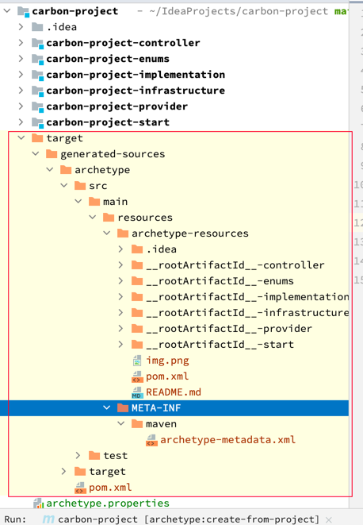
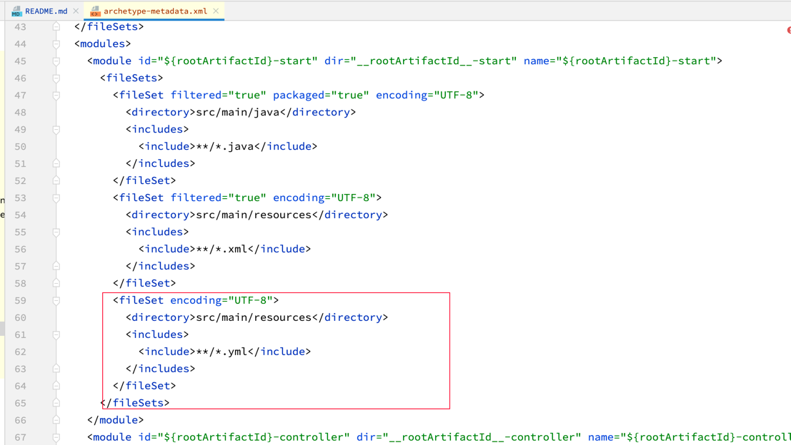
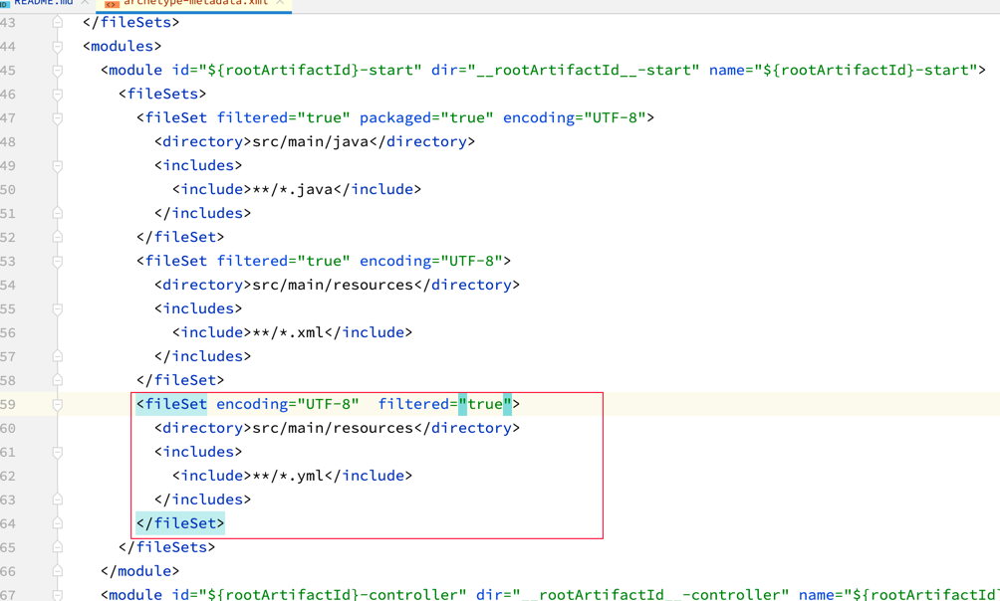
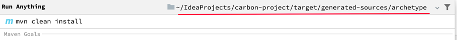
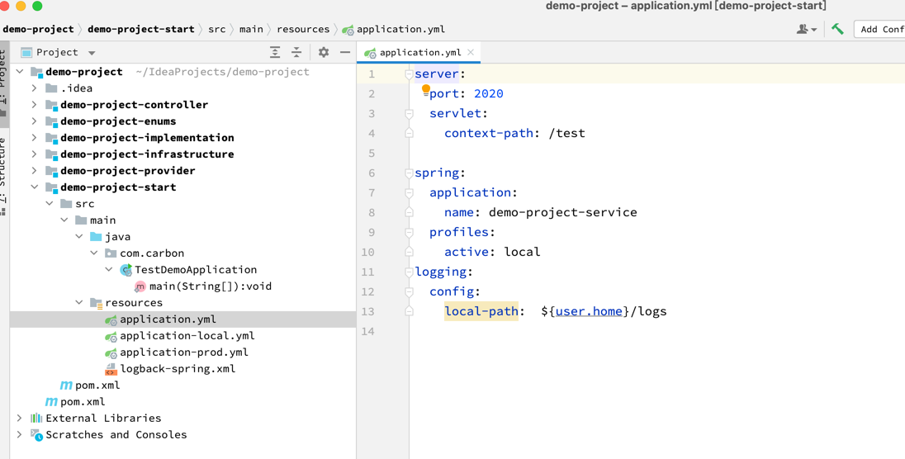

# carbon-project
base project framework for maven archetype

## maven 官方文档

https://maven.apache.org/archetype/maven-archetype-plugin/index.html

## 生成自己的archetype步骤

### mvn archetype:create-from-project

生成解析包


获取解析包结果



涉及到resource包的配置，需要在所生成的`archetype-metadata.xml` 文件手动修改配置

原配置：



修改为：



不然resource包里的配置使用到参数配置的，不会生效。


### mvn clean install

对解析包进行打包



## 最终使用

```bash
mvn archetype:generate -DarchetypeGroupId=com.carbon.archetype -DarchetypeArtifactId=carbon-project-archetype -DarchetypeVersion=1.0-SNAPSHOT -DgroupId=com.carbon -DartifactId=demo-project -Dpackage=com.carbon.demo -DappName=TestDemo -DcontextPath=test -DserverPort=2020
```

参数解释：
+ mvn archetype:generate
  + maven的命令
+ -DarchetypeGroupId
  + 你所要使用的archetype对应的groupId
+ -DarchetypeArtifactId
  + 你所要使用的archetype对应的artifactId
+ -DarchetypeVersion
  + 你所要使用的archetype对应的版本号
+ -DgroupId
  + 你所要生成的新项目的groupId
+ -DartifactId
  + 你所要生成的新项目的artifactId
+ -Dpackage
  + 基础包包名
+ -DappName
  + archetype.properties 中定义的appName的值,也是对应我们的启动类前缀
+ -DcontextPath
  + archetype.properties 中定义的contextPath的值,,也是我们application.yml 中的server.servlet.context-path 对应值
+ -DserverPort
  + archetype.properties 中定义的serverPort的值,也是我们application.yml 中的server.port 对应值

### 结果

